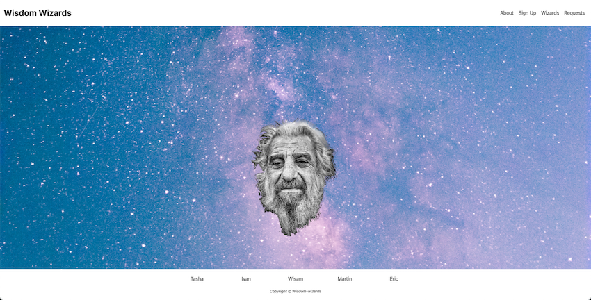

# Wisdom Wizards

## *The live site link can be found [Here]()*
### Table of contents

1. [Introduction](#Introduction)
1. [User Stories](#User-Stories)
1. [Design](#Design)
1. [Features](#Features)  
1. [Technologies and Frameworks](#Technologies-and-Frameworks)
1. [Manual Testing](#Manual-Testing)
1. [Deployment](#Deployment)
1. [Credits](#Credits)

## Introduction
Wisdom Wizards, connects older generations with the younger, via a weekly webinar service where the 'Wizards' educate the 'Wizettes' on anything from war tales to hangover cures! Anyone over 65 can sign up on the site to be 'Wizard', and any age under can sign up to be a 'wizette'.

### **Project**
Code Institute and Trust in SODA collaboratively present the May 2022 Hackathon

### **Project Theme**
Getting Connected:
The theme for this month is the all about getting connected. 
We Highlight the importance of 'staying connected' with solutions to help people connect virtually for a more connected world

### **Project description**
Wisdom Wizards, connects older generations with the younger, via a weekly webinar service where the 'Wizards' educate the 'Wizettes' on anything from war tales to hangover cures! Anyone over 65 can sign up on the site to be 'Wizard', and any age under can sign up to be a 'wizette'.

The website is build using primarily HTML5, CSS3 and Bootstrap.

### **Team: JavaCadabra**
 
Tasha Johnson on [GitHub](https://github.com/TashaTJ)\
Ivan M Ulysses on [GitHub](https://github.com/Sonicbasedrop)\
Wisam Altaqaly on [GitHub](https://github.com/WisamTa)\
Martin McInerney on [GitHub](https://github.com/martin-mcinerney)\
Eric Gaona on [GitHub](https://github.com/EricGaona)<br>
Team Facilitator: Jim Morel on [GitHub](https://github.com/JimLynx)


## User Stories

### **User goals**
- As a user, I want to be able to access site on various devices such us mobile, tablet or pc.
- As a user, I want to easily understand the main purpose of the site.
- As a user, I want to be able to easily navigate throughout the site to find desired content.

### **Site owner goals**
- As a Site owner, we want to connects with the younger generation, via a weekly webinar service where the 'Wizards' educate the 'Wizettes' on anything from war tales to hangover cures.
- As a Site owner, I want to Provide everyone who visits the site to have a good user experience.
- As a Site owner, I want to Provide user with easy site navigation.
- As a site owner, I want to provide user with contact options to Improve.customer satisfaction through better service.

### **The website needs to enable the User to**
- Able to understand the main purpose of the site.
- Navigate the site easily through categories clearly.
- Easy Navigate the site and find the relevant content.

### **The website needs to**
- Provide user with simple user friendly interface.
- Provide a good site navigation to easy understand.
- Categorize content by its Subject types and relevance.
- To Provide user with contact options.

## Scope
### **Functionality Requirements**
- The website
    - Use of Bootstrap for responsive design
- Website Navigation with internal site links.
   - Internal lins is Linked in the website template pages 
   - Categorized navigation by its Subject types and relevance.
   - Responsive bootstrap website navigation
- Thumbnail Gallery view
    - On click to reveal individual item detailed view with Javascript or Bootstarp.
- Customer Support contact form.

### **Content Requirements**
- NavBar
   - Internal site navigation Links with categories
   - Site brand name
   - Links to social media
- Landing Page
   - Full size Central Hero image
- About page
    - Short description 
- Detailed view 
    - Wizard Image
    - Wisdom Wizard Resume
- Sign page
   - Contact Form
- footer
   - Links to Contributor Github pages
   - Copyright information
   
## Skeleton
### **Wireframes**

- [Landing Page Wireframe](project_files/wireframes/desktop_landing_page.png)
  Showing more information of what the site is about, have an about file, signup, wizards, requests. <br>
- [About Page Wireframes](project_files/wireframes/about_page.png)<br>
  Showing more specific information about the website's purpose, we are a group of wise wizards eager to share our wisdom with the younger generations in weekly webinars to you, our Wizettes! Subjects range from child rearing to war stories to how to ward o! a hangover! Each session is an hour long and ends with a 20-minute Q&A.<br>
- [Sign Up Page Wireframes](project_files/wireframes/sign_up_page.png)<br>
  To become a wizard and to be able to host webinars<br>
- [Wizard Page Wireframes](project_files/wireframes/wizards.png)<br>
  Contains all wizard's profiles so users can choose a wise wizard to attend their webinar<br>
- [Request Page Wireframes](project_files/wireframes/requests_page.png)<br>
  Sending requests to a wizard to attend thier wibinar

## Design
### **Color Scheme**
- Color scheme used through out the site.

Can be found[here](project_files/readme_images/wisdom_wizard.png)

### **Fonts**
- Body main text font Oswald As a backup sans-serif.
- Header-text font family Roboto As a backup sans-serif.

### **Media**
All the images was supplied from adobe stock photos
## Features 
### **Existing Features**

- **Navigation**

    - Featured on all pages, the full responsive navigation bar includes links to the Logo, Home page and is identical in each page to allow for easy navigation.
    - Allow the user to easily navigate from page to page across all devices without having to revert back to the previous page via the ‘back’ button. 

- **Landing page** 

    - Large background image span the full width across the whole viewport and is responsive to all other browser sizes.

- **About page**

    - Responsive Image Grid that varies depending on screen size.
    - Click on image to reveal individual item detailed Modal.
    - Some of the Thumbnail images was created in Adobe illustrator to match rest of the images

- **Sign up Page**

    - Contact form allows users to communicate with the Wisdom Wizards
    - Contact page features Contributors names and contact info

- **Footer**

    - Footer was designed to be responsive across all devices.
    - Footer Contributors GitHub links and copyright information.

## Manual Testings

## **Technologies and Frameworks**

### **Languages Used**
-   [HTML5](https://en.wikipedia.org/wiki/HTML5) Hypertext Markup Language (HTML)
-   [CSS3](https://en.wikipedia.org/wiki/Cascading_Style_Sheets) Cascading Style Sheets (CSS)
-   [Bootstrap](https://getbootstrap.com/) Interactive functionality.

### **Frameworks, Libraries & Programs Used**
- [Bootstrap:](https://getbootstrap.com/docs/5.0/getting-started/download/) was used to assist with the responsiveness and to style the website.
- [Google Fonts:](https://fonts.google.com/) were used throughout the site.
- [jQuery:](https://jquery.com/) came with Bootstrap.
- [Git](https://git-scm.com/) Git was used for version control.
- [GitHub:](https://github.com/) used to store the projects code.
- [gitpod.io](https://gitpod.io/) gitpod Was used for codding.
- [Balsamiq:](https://balsamiq.com/) was used to create the wireframes.
- [Google Chrome Developer Tools](https://developers.google.com/web/tools/chrome-devtools)<br>
	 Google chromes built in developer tools are used to inspect page elements and help debug issues with the site layout and test different CSS styles.

## **Deployment**
### **Deploying on GitHub Pages**
1. Log into [GitHub](https://github.com/login) or [create an account](https://github.com/join).
1. Locate the [GitHub Repository](https://github.com/Sonicbasedrop/wisdom-wizards3).
1. At the top of the repository, select Settings from the menu items.
1. Scroll down the Settings page to the "GitHub Pages" section.
1. Under "Source" click the drop-down menu labelled "None" and select "Main Branch".
1. Upon selection, the page will automatically refresh meaning that the website is now deployed.
1. Scroll back down to the "GitHub Pages" section to retrieve the deployed link.
1. 

### **Forking the Repository**
1. Log into [GitHub](https://github.com/login) or [create an account](https://github.com/join).
1. Locate the [GitHub Repository](https://github.com/Sonicbasedrop/wisdom-wizards3).
1. At the top of the repository, on the right side of the page, select "Fork"
1. You should now have a copy of the original repository in your GitHub account.

### **Creating a Clone**
1. Install the [GitPod Browser](https://www.gitpod.io/docs/browser-extension/) Extension for Chrome.
1. After installation, restart the browser.
1. Log into [GitHub](https://github.com/login) or [create an account](https://github.com/join).
1. Locate the [GitHub Repository](https://github.com/Sonicbasedrop/wisdom-wizards3).
1. Click the green "GitPod" button in the top right corner of the repository.
This will trigger a new gitPod workspace to be created from the code in github where you can work locally.

**How to run this project within a local IDE, such as VSCode:**
1. Log into [GitHub](https://github.com/login) or [create an account](https://github.com/join).
1. Locate the [GitHub Repository](https://github.com/Sonicbasedrop/wisdom-wizards3").
1. Under the repository name, click "Clone or download".
1. In the Clone with HTTPs section, copy the clone URL for the repository.
1. In your local IDE open the terminal.
1. Change the current working directory to the location where you want the cloned directory to be made.
1. Type 'git clone', and then paste the URL you copied in Step 3.
```
git clone https://github.com/USERNAME/REPOSITORY
```
8. Press Enter. Your local clone will be created.

  Further reading and troubleshooting on cloning a repository from GitHub [here](https://docs.github.com/en/free-pro-team@latest/github/creating-cloning-and-archiving-repositories/cloning-a-repository) 

## Credits 

 Ackowledgements:<br>
[Code Institute](https://hackathon.codeinstitute.net/)<br>
[Faraday Academy](https://www.youtube.com/c/FaradayAcademy/featured)<br>
[freeCodeCamp](https://www.freecodecamp.org/news/how-to-become-a-git-expert-e7c38bf54826/)<br>

Code:


### **Code**
-  [stackoverflow.com](https://stackoverflow.com/): Useful website for code tips.

### Content 

- The icons in the footer were taken from [Font Awesome](https://fontawesome.com/)